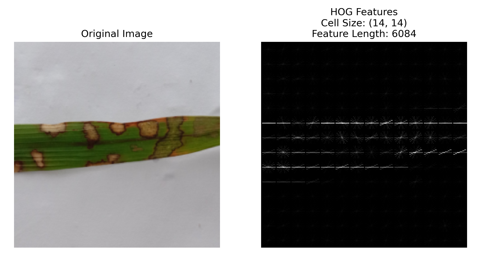

# Leveraging Pre-trained CNNs for Efficient Feature Extraction in Rice Leaf Disease Classification

## Abstract
This study evaluates the integration of feature extraction methodologies within pre-trained convolutional neural networks (CNNs) for rice disease classification. Baseline models achieved commendable performance, with significant enhancements observed upon integrating Histogram of Oriented Gradients (HOG) across various CNN architectures, notably in EfficientNet-B7. Local Binary Patterns (LBP) also contributed to performance improvements, albeit to a lesser extent. Visualizing neural network decision-making using Grad-CAM provided insights into important regions within rice images for disease identification.

## Introduction
Rice disease classification is crucial for agricultural research, especially in countries like Bangladesh. This study aims to enhance classification accuracy by integrating feature extraction techniques within pre-trained CNNs.

## Methodology Overview
- **Dataset**: Utilizes a dataset containing images of different rice diseases.
- **Feature Extraction Techniques**: Focuses on Histogram of Oriented Gradients (HOG) and Local Binary Patterns (LBP).
- **CNN Architectures**: Evaluates several pre-trained architectures including ResNet, VGG, MobileNetV2, InceptionV3, and EfficientNet-B7.

## Experimental Setup
The experiments were conducted on a machine with the following specifications:
- Processor: Intel Core i7-8700K
- GPU: NVIDIA GeForce RTX 2080 Ti
- Memory: 32GB RAM

## Results and Discussion
- Baseline models achieved decent accuracies.
- Integration of HOG led to significant improvements in classification accuracy across various CNN architectures, especially in EfficientNet-B7.
- LBP also contributed to performance enhancements, albeit to a lesser extent.
- Visualizing neural network decision-making using Grad-CAM provided insights into important regions within rice images for disease identification.

## Comparison with Previous Techniques
The proposed method outperformed several previous techniques, achieving a high accuracy of 97% with EfficientNet-B7 and HOG.

## Conclusion
The study concludes that HOG plays a crucial role in refining feature representations and improving classification accuracy in rice disease identification. However, LBP showed less impact on performance. The integration of Grad-CAM enhanced interpretability by highlighting disease-affected areas within rice images.

## Code Availability
Code is available at: [GitHub Repository](https://github.com/shohanursobuj/LeafExtractCNN).

## Visualization

*Fig. 1: Visualization of HOG Features for Brown Spot Disease in Rice Leaves.*

## Citation

If you use this code or the obtained results in your work, please cite this project as:

```
@INPROCEEDINGS{10499603,
  author={Islam Sobuj, Md. Shohanur and Hossen, Md. Imran and Mahmud, Md. Foysal and Islam Khan, Mahbub Ul},
  booktitle={2024 International Conference on Advances in Computing, Communication, Electrical, and Smart Systems (iCACCESS)}, 
  title={Leveraging Pre-trained CNNs for Efficient Feature Extraction in Rice Leaf Disease Classification}, 
  year={2024},
  volume={},
  number={},
  pages={01-06},
  keywords={Histograms;Visualization;Refining;Neural networks;Propulsion;Feature extraction;Convolutional neural networks;Rice Disease Classification;Feature Extraction;Histogram of Oriented Gradients (HOG);Local Binary Patterns (LBP);Convolutional Neural Networks (CNNs);Grad-CAM},
  doi={10.1109/iCACCESS61735.2024.10499603}
}


```
